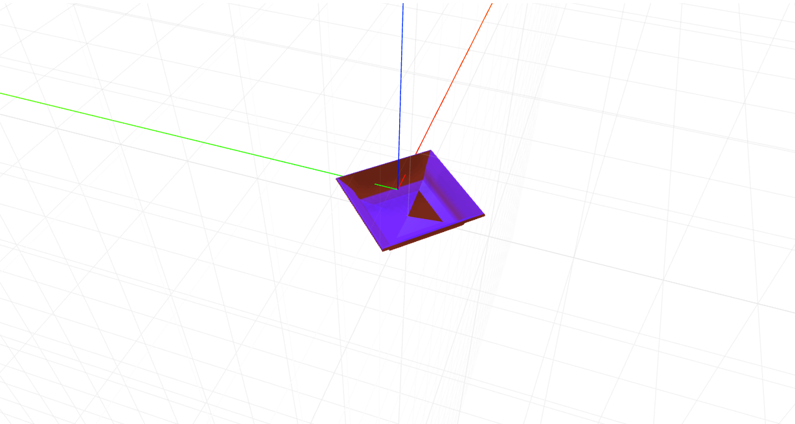

# craft-bowl

# Install
`$ npm install craft-bowl`

# Parameters
```sh
resolution - determines how many sides the bottle will have.
depth - decides how deep the bowl is.
radius - determines the radius of the base of the bowl.
```

# Example
```html
<craft>
	<craft name="bowl" module="craft-bowl"/>
	<bowl></bowl>
</craft>
```

